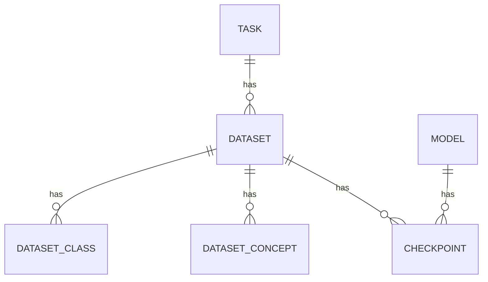

# **Admin Component**
 
A single interface to manage the four core resources of the app: **Tasks**, **Models**, **Datasets**, and **Checkpoints**.
 
## **Purpose**
 
The Admin component is where configuration data is created and maintained — the tasks available, the models registered, the datasets and their classes/concepts, and the checkpoints linking a model to a dataset. This data then powers the prediction interface elsewhere in the app.
 
 
## **Data Model**

 
| Entity | Description |
|---|---|
| **Task** | An NLP task (e.g. sentiment analysis) |
| **Model** | An encoder or LLM |
| **Dataset** | A dataset tied to a task, with output classes and optional concepts |
| **Checkpoint** | Trained weights linking a model + dataset + number of attention heads |
 
## **API**
 
Reads and writes are split across two route groups:
 
| Resource | GET | POST | PUT | DELETE |
|---|---|---|---|---|
| Task | `/data/tasks` | `/admin/tasks` | `/admin/tasks/{id}` | `/admin/tasks/{id}` |
| Model | `/data/models` | `/admin/models` | `/admin/models/{id}` | `/admin/models/{id}` |
| Dataset | `/data/datasets` | `/admin/datasets` | `/admin/datasets/{id}` | `/admin/datasets/{id}` |
| Checkpoint | `/data/checkpoints` | `/admin/checkpoints` | `/admin/checkpoints/{id}` | `/admin/checkpoints/{id}` |
 
`/data/*` routes serve reads; `/admin/*` routes handle writes — a natural boundary for later access control.
 
## **How It Works**
 
1. On load, the four lists are fetched and shown as tabs.
2. Each tab has an inline add/edit form and a table of existing entries.
3. Deletions go through a confirmation dialog before hitting the API.
4. After any write, all lists are simply reloaded — keeping the UI always in sync with the backend, at the cost of an extra round trip.
## **Notable Details**
 
- Creating a **Dataset** sends its classes and concepts in the same request.
- Deleting a **Task** or **Dataset** cascades to its related classes, concepts, and checkpoints on the backend.
- A **Checkpoint** ties together a model, a dataset, a head count, and a Hugging Face repo ID.
 
