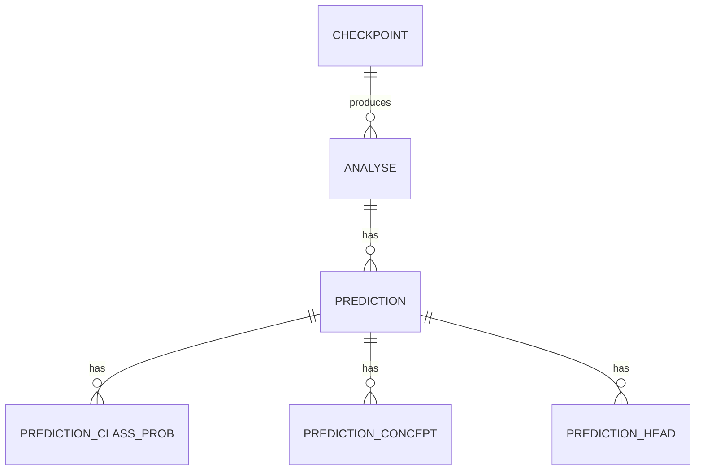

# **History Module**
 
Browsable, filterable log of past predictions, with stats and CSV export.
 
## **Purpose**
 
Every prediction made through the app can be saved as an **Analyse** (input, routing decision, thresholds) linked to a **Prediction** (label, confidence, epistemic/aleatoric uncertainty, per-class probabilities, per-concept values, per-head outputs). The History module lets users search, filter, paginate, and export that log.
 
## **Data Model**
 

 
| Entity | Description |
|---|---|
| **Analyse** | One submitted prediction request: input text, mode, thresholds, routing decision |
| **Prediction** | The model's output for that analyse: label, confidence, epistemic/aleatoric scores |
| **PredictionClassProb** | Probability per output class |
| **PredictionConcept** | Value + uncertainty per concept (when the dataset supports concepts) |
| **PredictionHead** | Per-attention-head prediction, used for the head-level charts |
 
## **API**
 
| Action | Method | Endpoint |
|---|---|---|
| Save a prediction | `POST` | `/analyse/save` |
| List history (paginated, filterable) | `GET` | `/analyse/history` |
| Aggregate stats (totals, routing breakdown, avg confidence) | `GET` | `/analyse/history/stats` |
| Full detail of one analyse | `GET` | `/analyse/history/{id}` |
 
`GET /analyse/history` accepts: `limit`, `offset`, `search`, `routing`, `model`, `dataset`, `date_from`, `date_to`.
 
## **Component Flow**
 
1. On load, `HistoryComponent` fetches stats, the current page of history, and the distinct model/dataset lists (used to populate filter dropdowns).
2. Any filter change resets to page 1 and reloads both the list and the stats.
3. Sorting, pagination, and page-size changes all re-trigger `loadData()` — filtering happens server-side, not in the browser.
4. Row details expand inline, showing full text, model, dataset, head count, and date.
5. Export builds a CSV client-side, from either the selected rows or the whole current dataset.

 

