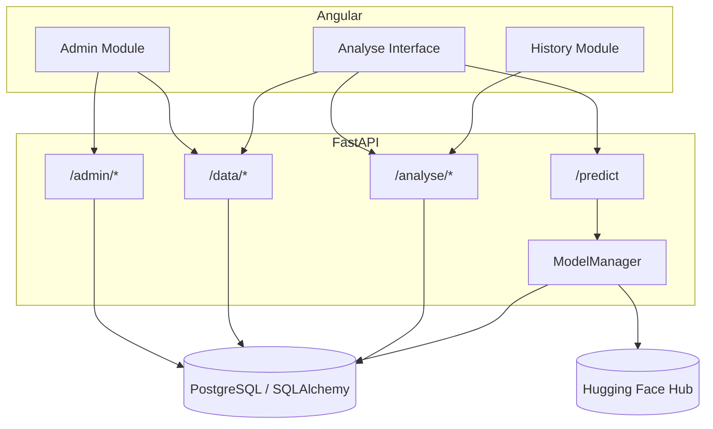
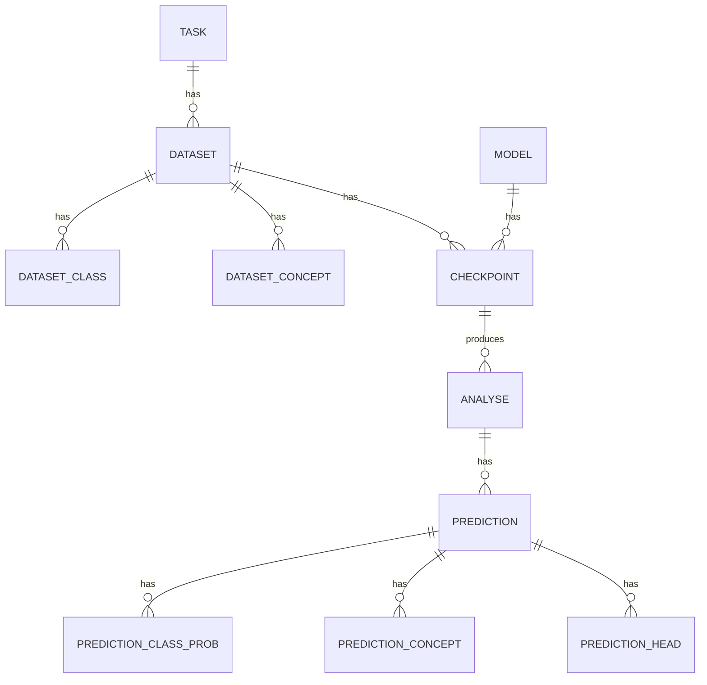

# **Credence Platform Overview**
 
CREDENCE is an uncertainty-aware text classification platform: it runs predictions through configurable encoder/LLM models and decomposes the result into epistemic and aleatoric uncertainty, routing each prediction toward trust, review, or abstention.
 
## **System Architecture**
 

 
## **Modules**
 
| Module | Role |
|---|---|
| **Admin** | Manage configuration data: tasks, models, datasets (with classes/concepts), and checkpoints |
| **Analyse Interface** | Submit text, run a model, and visualize confidence, uncertainty, and routing |
| **History** | Browse, filter, and export the log of past predictions |
 
Each module owns a distinct slice of the backend: Admin writes configuration, the Analyse Interface reads configuration and calls the model, and History reads/writes the analysis log.
 
## **Data Model, End to End**
 

 
Configuration (Task → Dataset → Checkpoint) is set up once through Admin. Every prediction made afterward references a specific Checkpoint, and is recorded as an Analyse + Prediction pair, which History later surfaces.
 
## **Prediction Lifecycle**
 
1. **Configure** — an admin registers a task, a dataset (with its classes/concepts), a model, and a checkpoint linking model + dataset + head count, backed by a repo on the Hugging Face Hub.
2. **Predict** — a user picks a model/dataset/head combination in the Analyse Interface, submits text, and `ModelManager` lazily loads the encoder and the corresponding CREDENCE checkpoint (cached in memory after first use).
3. **Decompose** — the backend returns a label, confidence, epistemic and aleatoric uncertainty, and — depending on the dataset — per-class probabilities, per-concept values, and per-head predictions.
4. **Route** — the frontend classifies the result as TRUST, DATA, REVIEW, or ABSTAIN based on two adjustable thresholds.
5. **Log** — the result is saved as an Analyse/Prediction pair, later browsable and exportable through History.
## **API Surface**
 
| Prefix | Purpose |
|---|---|
| `/admin` | Create, update, delete configuration (tasks, models, datasets, checkpoints) |
| `/data` | Read configuration — feeds both Admin and the Analyse Interface |
| `/predict` | Run a model against submitted text |
| `/analyse` | Save predictions and query prediction history |
 

 
